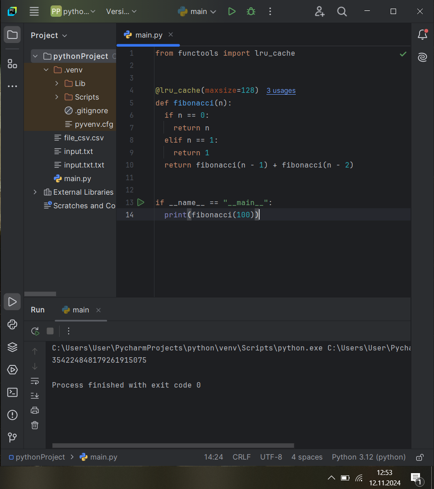
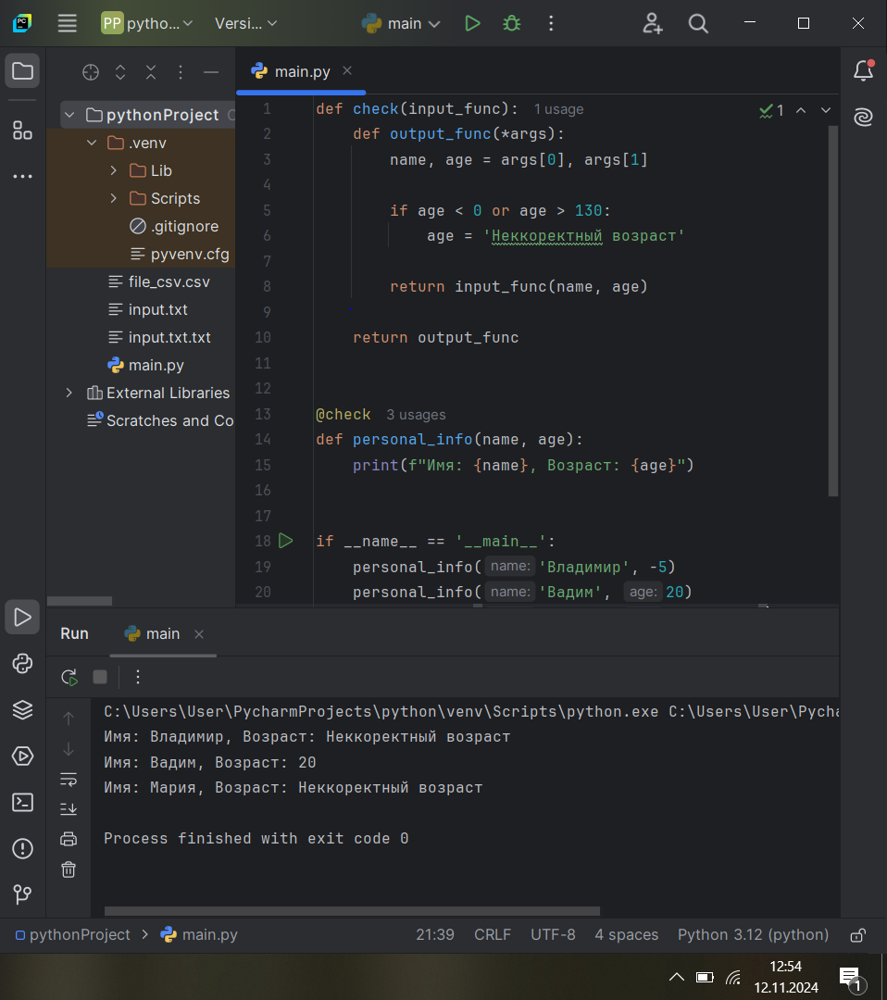
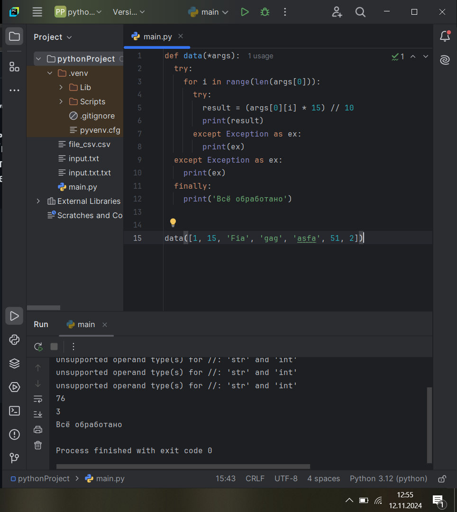
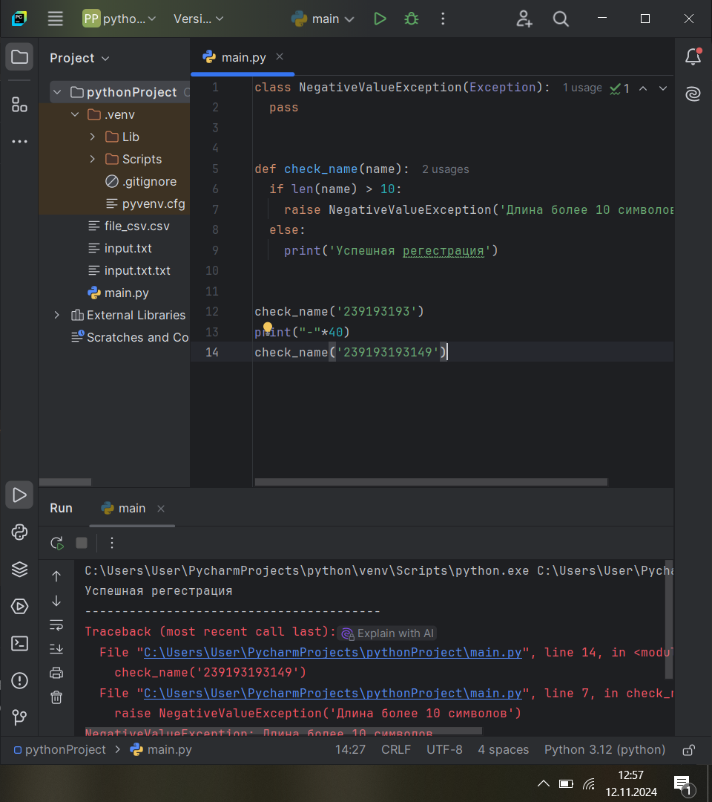
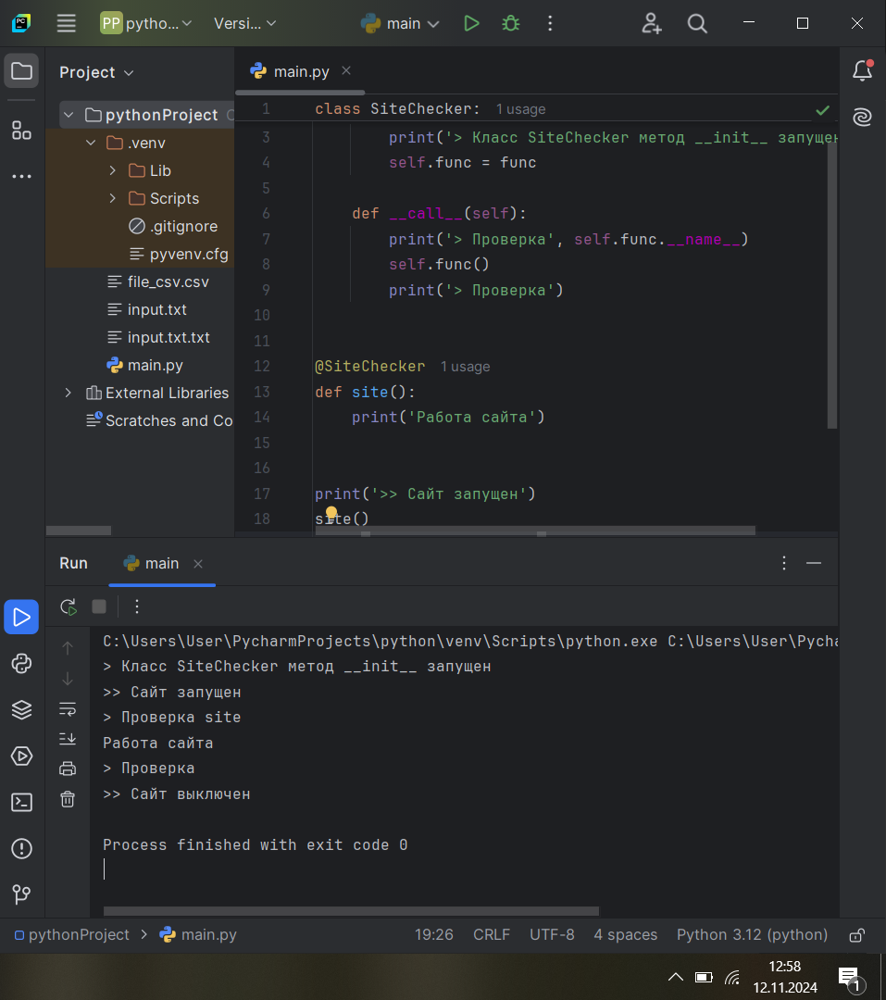
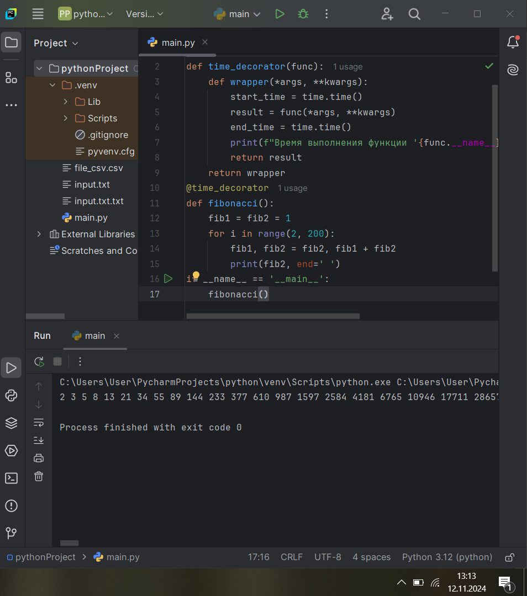
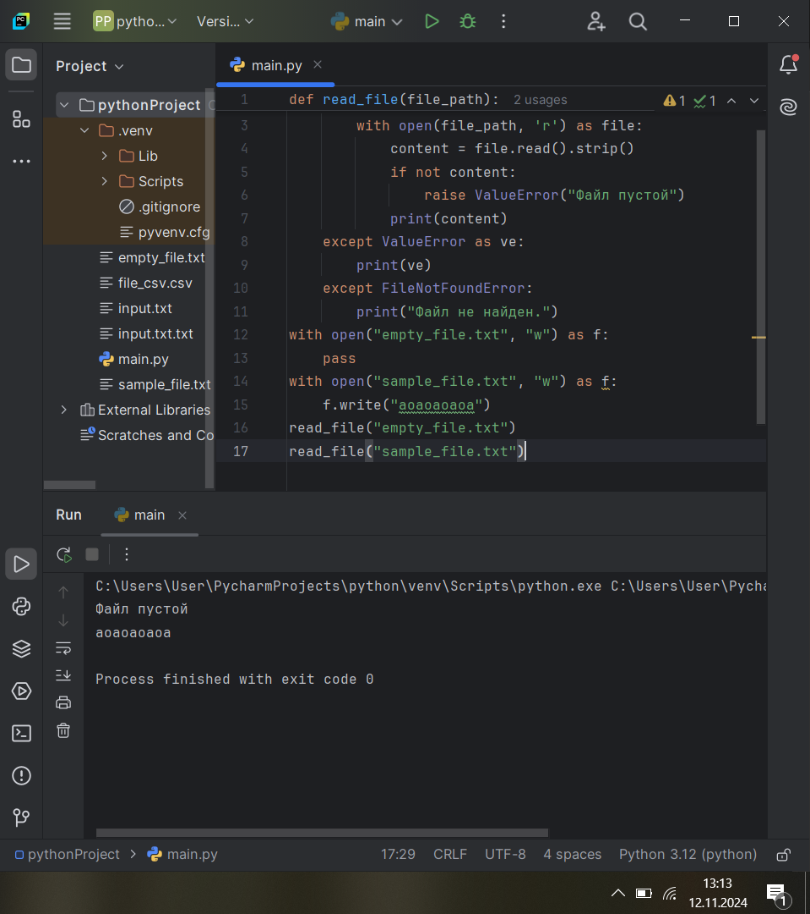
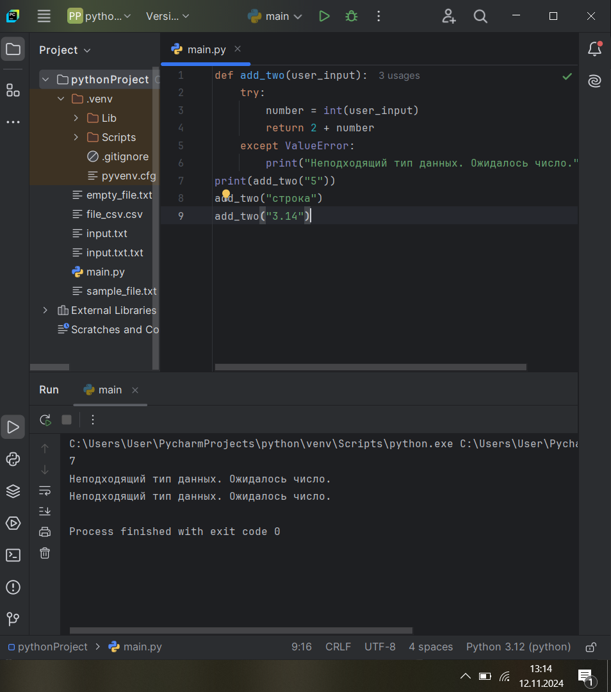
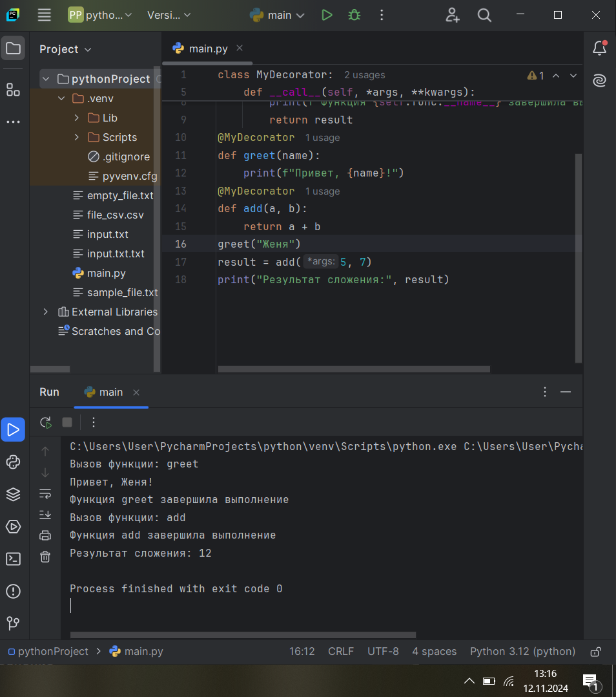
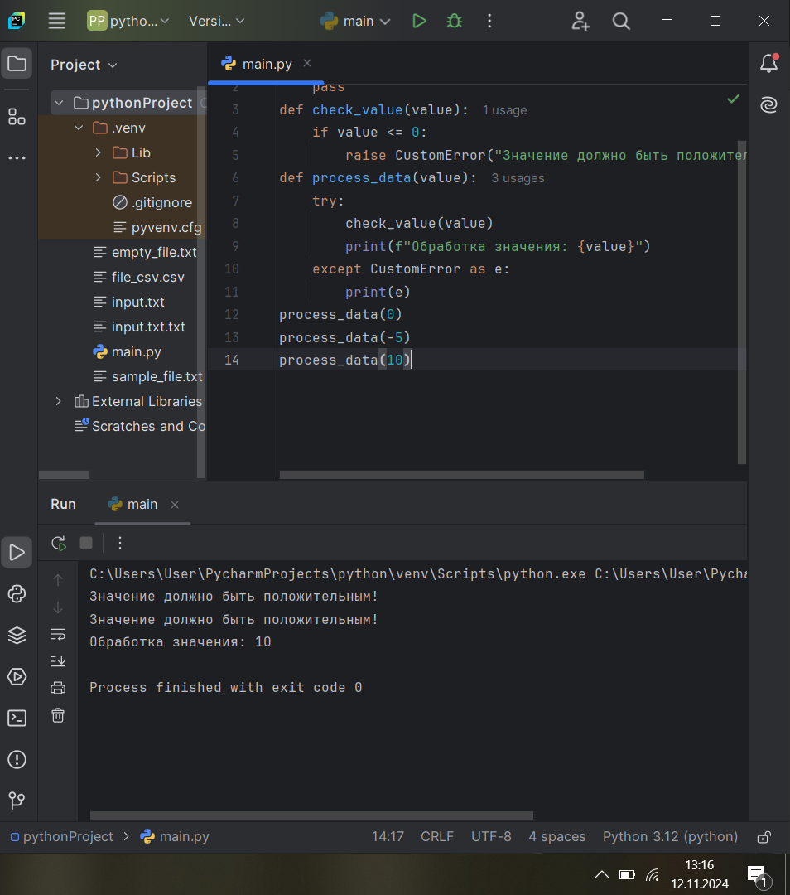

Тема 10. Декораторы и исключения
Отчет по Теме #10 выполнила:
- Балахнина Евгения Николаевна
- АИС-22-1

| Задание | Лаб_раб | Сам_раб |
| ------ | ------ | ------ |
| Задание 1 | + | + |
| Задание 2 | + | + |
| Задание 3 | + | + |
| Задание 4 | + | + |
| Задание 5 | + | + |

знак "+" - задание выполнено; знак "-" - задание не выполнено;

Работу проверили:
- к.э.н., доцент Панов М.А.

## Лабораторная работа №1
### Наверняка вы думаете, что декораторы – это какая-то бесполезная вещь, которая вам никогда не пригодится, но тут вдруг на паре по математике преподаватель просит всех посчитать число Фибоначчи для 100. Кто-то будет считать вручную (так точно не нужно), кто-то посчитает на калькуляторе, а кто-то подумает, что он самый крутой и напишет рекурсивную программу на Python и немного огорчится, потому что данная программа будет достаточно долго считаться, если ее просто так запускать. Но именно тут к вам на помощь приходят декораторы, например @lru_cache (он предназначен для решения задач динамическим программированием, если простыми словами, то этот декоратор запоминает промежуточные результаты и при рекурсивном вызове функции программа не будет считать одни и те же значения, а просто “возьмёт их из этого декоратора”). Вам нужно написать программу, которая будет считать числа Фибоначчи для 100 и запустить ее без этого декоратора и с ним, посмотреть на разницу во времени решения поставленной задачи. P.S. при запуске без декоратора можете долго не ждать, для наглядности хватит 10 секунд ожидания.

```python
from functools import lru_cache


@lru_cache(maxsize=128)
def fibonacci(n):
  if n == 0:
    return n
  elif n == 1:
    return 1
  return fibonacci(n - 1) + fibonacci(n - 2)


if __name__ == "__main__":
  print(fibonacci(100))
```
### Результат.


## Лабораторная работа №2
### Илья пишет свой сайт и ему необходимо сделать минимальную проверку ввода данных пользователя при регистрации. Для этого он реализовал функцию, которая выводит данные пользователя на экран и решил, что будет проверять правильность введённых данных при помощи декоратора, но в этом ему потребовалась ваша помощь. Напишите декоратор для функции, который будет принимать все параметры вызываемой функции (имя, возраст) и проверять чтобы возраст был больше 0 и меньше 130. Причем заметьте, что неважно сколько пользователь введет данных на сайт к Илье, будут обрабатываться только первые 2 аргумента.

```python
def check(input_func):
  def output_func(*args):
    name, age = args[0], args[1]

    if age < 0 or age > 130:
      age = 'Неккоректный возраст'
    
    return input_func(name, age)

  return output_func

  
@check 
def personal_info(name, age):
  print(f"Имя: {name}, Возраст: {age}")


if __name__ == '__main__':
  personal_info('Владимир', -5)
  personal_info('Вадим', 20)
  personal_info('Мария', 139, 1, 51)
```
### Результат.


## Лабораторная работа №3
### Вам понравилась идея Ильи с сайтом, и вы решили дальше работать вместе с ним. Но вот в вашем проекте появилась проблема, кто-то пытается сломать вашу функцию с получением данных для сайта. Эта функция работает только с данными integer, а какой-то недохакер пытается все сломать и вместо нужного типа данных отправляет string. Воспользуйтесь исключениями, чтобы неподходящий тип данных не ломал ваш сайт. Также дополнительно можете обернуть весь код функции в try/except/finally для того, чтобы программа вас оповестила о том, что выявлена какая-то ошибка или программа успешно выполнена.

```python
def data(*args):
  try: 
    for i in range(len(args[0])):
      try:
        result = (args[0][i] * 15) // 10
        print(result)
      except Exception as ex:
        print(ex)
  except Exception as ex:
    print(ex)
  finally:
    print('Всё обработано')


data([1, 15, 'Fia', 'gag', 'asfa', 51, 2])
```
### Результат.


## Лабораторная работа №4
### Продолжая работу над сайтом, вы решили написать собственное исключение, которое будет вызываться в случае, если в функцию проверки имени при регистрации передана строка длиннее десяти символов, а если имя имеет допустимую длину, то в консоль выводиться “Успешная регистрация”

```python
class NegativeValueException(Exception):
  pass


def check_name(name):
  if len(name) > 10:
    raise NegativeValueException('Длина более 10 символов')
  else:
    print('Успешная регестрация')


check_name('239193193')
print("-"*40)
check_name('239193193149')
```
### Результат.


## Лабораторная работа №5
### После запуска сайта вы поняли, что вам необходимо добавить логгер, для отслеживания его работы. Готовыми вариантами вы не захотели пользоваться, и поэтому решили создать очень простую пародию. Для этого создали две функции: __init__() (вызывается при создании класса декоратора в программе) и __call__() (вызывается при вызове декоратора). Создайте необходимый вам декоратор. Выведите все логи в консоль.

```python
class SiteChecker:
  def __init__(self, func):
    print('> Класс SiteChecker метод __init__ запущен')
    self.func = func

  
  def __call__(self):
    print('> Проверка', self.func.__name__)
    self.func()
    print('> Проверка')


@SiteChecker
def site():
  print('Работа сайта')


print('>> Сайт запущен')
site()
print('>> Сайт выключен')
```
### Результат.


## Самостоятельная работа №1
Вовочка решил заняться спортивным программированием на python, но для этого он должен знать за какое время выполняется его программа. Он решил, что для этого ему идеально подойдет декоратор для функции, который будет выяснять за какое время выполняется та или иная функция. Помогите Вовочке в его начинаниях и напишите такой декоратор. 
Подсказка: необходимо использовать модуль time Декоратор необходимо использовать для этой функции: 
```python
def fibonacci():
   fib1 = fib2 = 1
   for i in range(2, 200):
      fib1, fib2 = fib2, fib1 + fib2 print(fib2, end=' ')
if		name	== '	main	':
   fibonacci()
```

Результатом вашей работы будет листинг кода и скриншот консоли, в котором будет выполненная функция Фибоначчи и время выполнения программы. 
Также на этом примере можете посмотреть, что решение задач через рекурсию не всегда является хорошей идеей. Поскольку решение Фибоначчи для 100 с использованием рекурсии и без динамического программирования решается более десяти секунд, а решение точно такой же задачи, но через цикл for еще и для 200, занимает меньше 1 секунды. 

```python
import time
def time_decorator(func):
    def wrapper(*args, **kwargs):
        start_time = time.time()
        result = func(*args, **kwargs)
        end_time = time.time()
        print(f"Время выполнения функции '{func.__name__}': {end_time - start_time} секунд")
        return result
    return wrapper
@time_decorator
def fibonacci():
    fib1 = fib2 = 1
    for i in range(2, 200):
        fib1, fib2 = fib2, fib1 + fib2
        print(fib2, end=' ')
if __name__ == '__main__':
    fibonacci()
```
### Результат.


## Выводы
Код демонстрирует использование декораторов для измерения времени выполнения функций. Декораторы позволяют расширять функциональность существующих функций, не меняя их исходный код

## Самостоятельная работа №2
Посмотрев на Вовочку, вы также загорелись идеей спортивного программирования, начав тренировки вы узнали, что для решения некоторых задач необходимо считывать данные из файлов. Но через некоторое время вы столкнулись с проблемой что файлы бывают пустыми, и вы не получаете вводные данные для решения задачи. После этого вы решили не просто считывать данные из файла, а всю конструкцию оборачивать в исключения, чтобы избежать такой проблемы. Создайте пустой файл и файл, в котором есть какая-то информация. Напишите код программы. Если файл пустой, то, нужно вызвать исключение (“бросить исключение”) и вывести в консоль “файл пустой”, а если он не пустой, то вывести информацию из файла. 

```python
def read_file(file_path):
    try:
        with open(file_path, 'r') as file:
            content = file.read().strip() 
            if not content:
                raise ValueError("Файл пустой")
            print(content)
    except ValueError as ve:
        print(ve)
    except FileNotFoundError:
        print("Файл не найден.")
with open("empty_file.txt", "w") as f:
    pass
with open("sample_file.txt", "w") as f:
    f.write("аоаоаоаоа")
read_file("empty_file.txt")
read_file("sample_file.txt")
```
### Результат.


## Выводы
Код демонстрирует обработку исключений при чтении файлов, а также создание и запись в файлы

## Самостоятельная работа №3
Напишите функцию, которая будет складывать 2 и введенное пользователем число, но если пользователь введет строку или другой неподходящий тип данных, то в консоль выведется ошибка “Неподходящий тип данных. Ожидалось число.”. Реализовать функционал программы необходимо через try/except и подобрать правильный тип исключения. Создавать собственное исключение нельзя. Проведите несколько тестов, в которых исключение вызывается и нет. Результатом выполнения задачи будет листинг кода и получившийся вывод в консоль 

```python
def add_two(user_input):
    try:
        number = int(user_input)
        return 2 + number 
    except ValueError:
        print("Неподходящий тип данных. Ожидалось число.")
print(add_two("5"))
add_two("строка")
add_two("3.14")
```
### Результат.


## Выводы
Основная цель функции add_two() - принять числовой ввод от пользователя и вернуть результат сложения этого числа с 2, обрабатывая при этом возможные ошибки

## Самостоятельная работа №4
Создайте собственный декоратор, который будет использоваться для двух любых вами придуманных функций. Декораторы, которые использовались ранее в работе нельзя воссоздавать. Результатом выполнения задачи будет: класс декоратора, две как-то связанными с ним функциями, скриншот консоли с выполненной программой и подробные комментарии, которые будут описывать работу вашего кода. 

```python
class MyDecorator:
    def __init__(self, func):
        self.func = func

    def __call__(self, *args, **kwargs):
        print(f"Вызов функции: {self.func.__name__}")
        result = self.func(*args, **kwargs)
        print(f"Функция {self.func.__name__} завершила выполнение")
        return result
@MyDecorator
def greet(name):
    print(f"Привет, {name}!")
@MyDecorator
def add(a, b):
    return a + b
greet("Женя")
result = add(5, 7)
print("Результат сложения:", result)
```
### Результат.


## Выводы
Этот код служит хорошим примером того, как можно использовать декораторы для обогащения функциональности других функций, не изменяя их исходный код.

## Самостоятельная работа №5
Создайте собственное исключение, которое будет использоваться в двух любых фрагментах кода. Исключения, которые использовались ранее в работе нельзя воссоздавать. Результатом выполнения задачи будет: класс исключения, код к котором в двух местах используется это исключение, скриншот консоли с выполненной программой и подробные комментарии, которые будут описывать работу вашего кода.

```python
class CustomError(Exception):
    pass
def check_value(value):
    if value <= 0:
        raise CustomError("Значение должно быть положительным!")
def process_data(value):
    try:
        check_value(value)
        print(f"Обработка значения: {value}")
    except CustomError as e:
        print(e)
process_data(0)
process_data(-5)
process_data(10)
```
### Результат.


## Выводы
Код демонстрирует использование пользовательского исключения для проверки входных данных и обработки ошибочных ситуаций

### Общие выводы по теме
Декораторы и исключения — это два мощных инструмента в Python, которые помогают улучшить читаемость кода, организовать его и повысить устойчивость к ошибкам.
