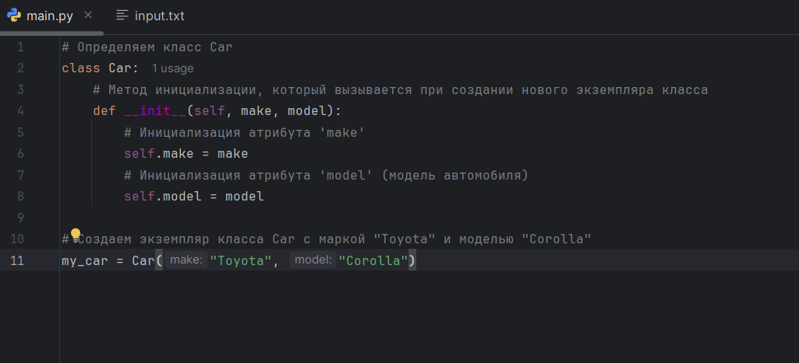
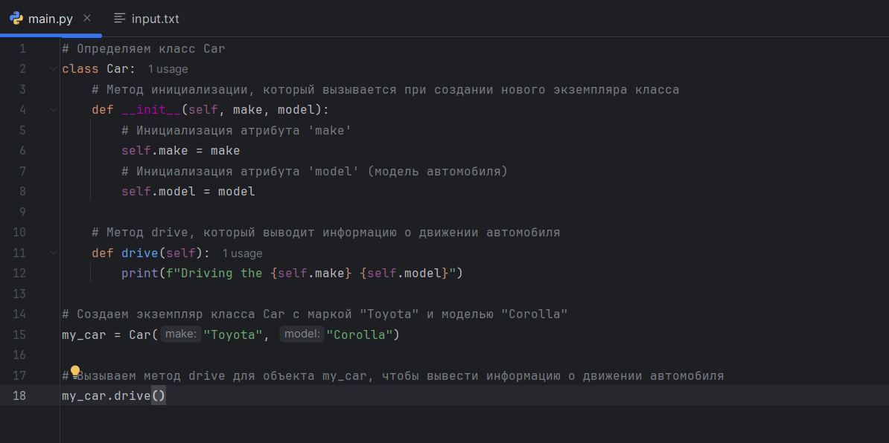
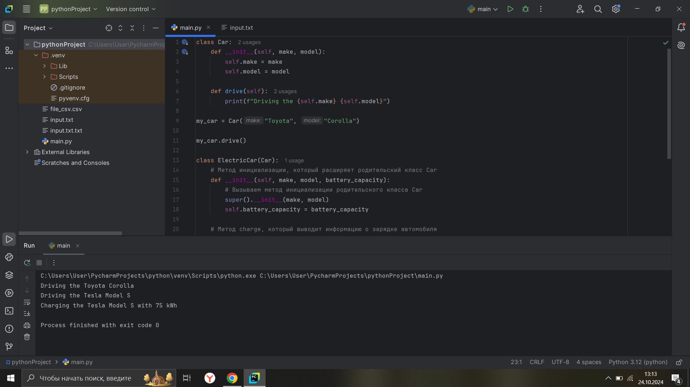
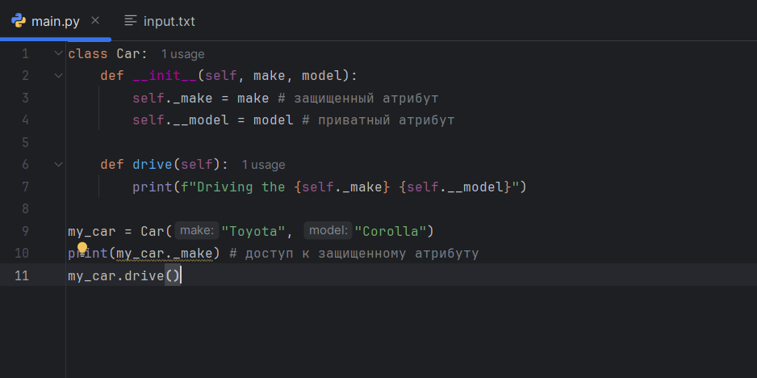
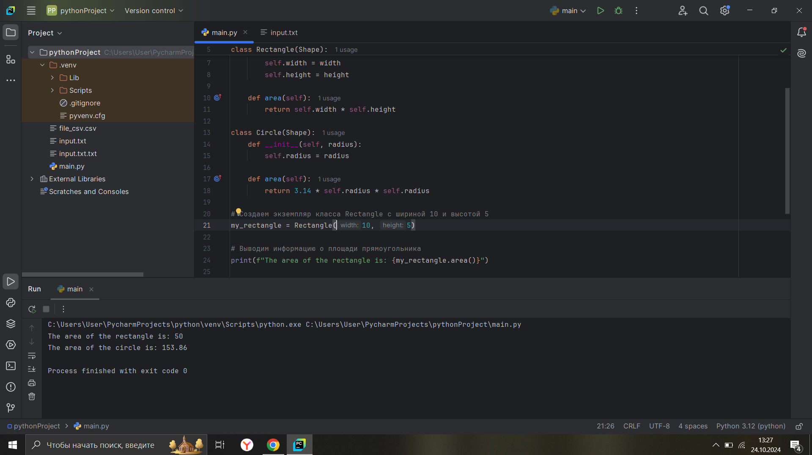
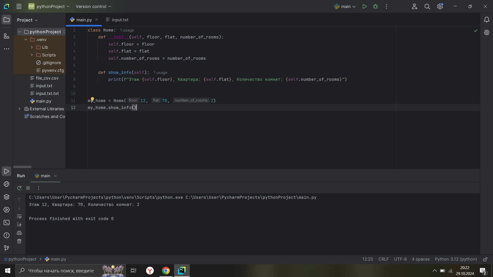
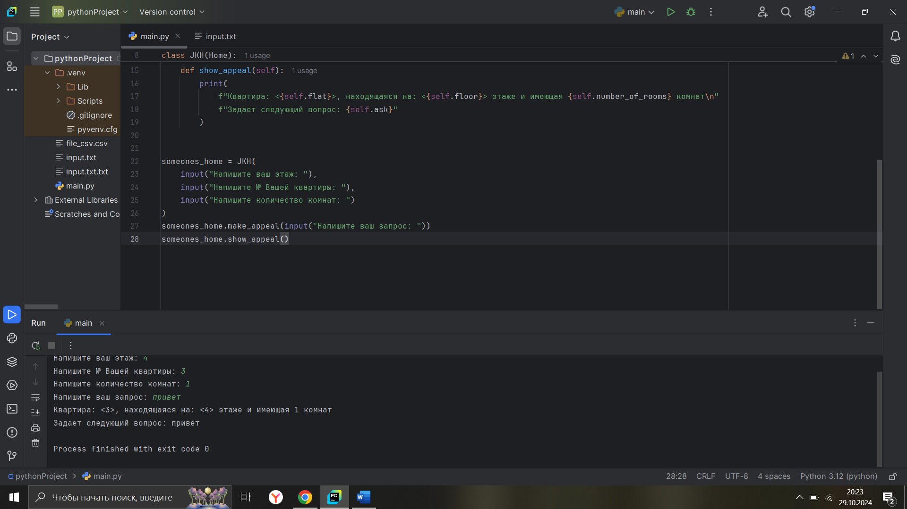
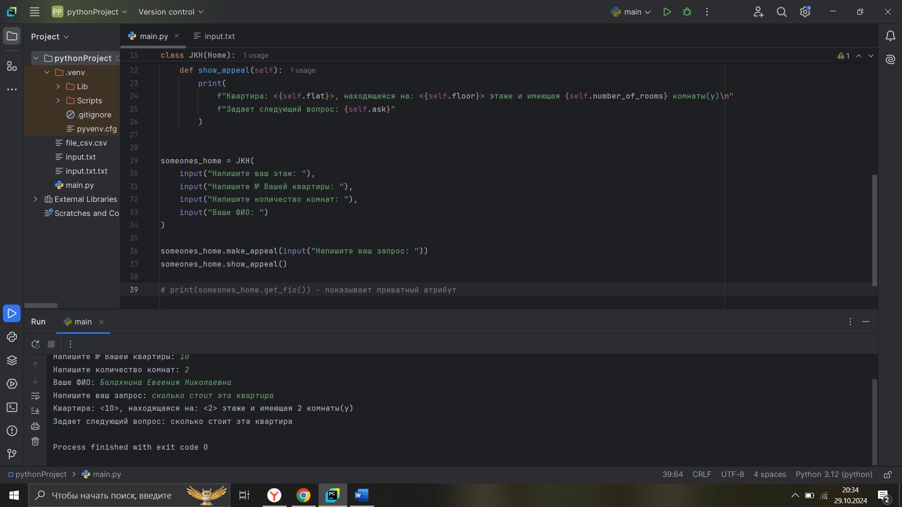
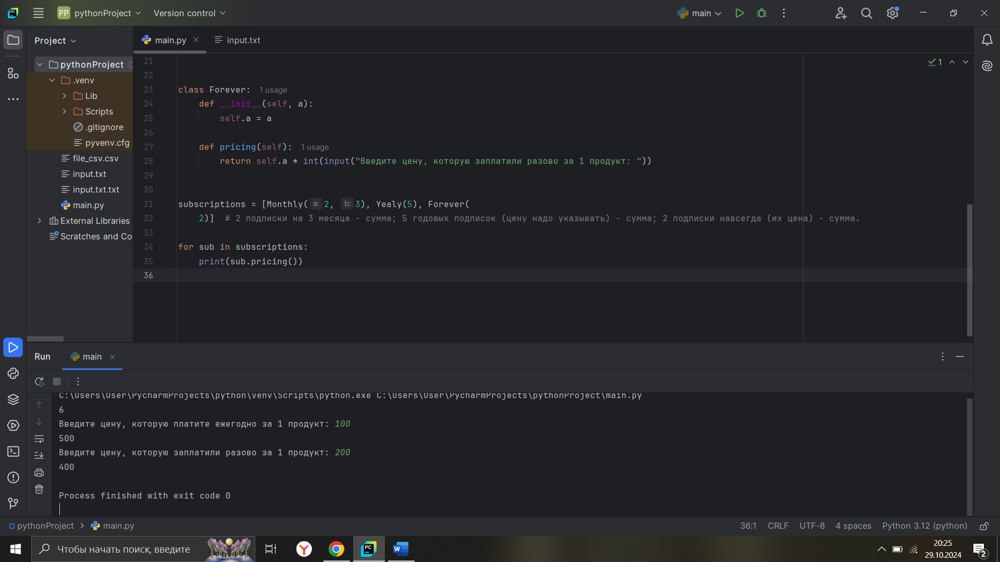

# Тема 7. Основы объектно-ориентированного программирования
Отчет по Теме #7 выполнила:
- Балахнина Евгения
- АИС-22-1

| Задание | Лаб_раб | Сам_раб |
| ------ | ------ | ------ |
| Задание 1 | + | + |
| Задание 2 | + | + |
| Задание 3 | + | + |
| Задание 4 | + | + |
| Задание 5 | + | + |


знак "+" - задание выполнено; знак "-" - задание не выполнено;

Работу проверили:
- к.э.н., доцент Панов М.А.

## Лабораторная работа №1
### Создайте класс “Car” с атрибутами производитель и модель. Создайте объект этого класса. Напишите комментарии для кода, объясняющие его работу.

```python
# Определяем класс Car
class Car:
    # Метод инициализации, который вызывается при создании нового экземпляра класса
    def __init__(self, make, model):
        # Инициализация атрибута 'make'
        self.make = make
        # Инициализация атрибута 'model' (модель автомобиля)
        self.model = model

# Создаем экземпляр класса Car с маркой "Toyota" и моделью "Corolla"
my_car = Car("Toyota", "Corolla")
```
### Результат.



## Лабораторная работа №2
### Дополните код из первого задания, добавив в него атрибуты и методы класса, заставьте машину “поехать”. Напишите комментарии для кода, объясняющие его работу. 

```python
# Определяем класс Car
class Car:
    # Метод инициализации, который вызывается при создании нового экземпляра класса
    def __init__(self, make, model):
        # Инициализация атрибута 'make'
        self.make = make
        # Инициализация атрибута 'model' (модель автомобиля)
        self.model = model

    # Метод drive, который выводит информацию о движении автомобиля
    def drive(self):
        print(f"Driving the {self.make} {self.model}")

# Создаем экземпляр класса Car с маркой "Toyota" и моделью "Corolla"
my_car = Car("Toyota", "Corolla")

# Вызываем метод drive для объекта my_car, чтобы вывести информацию о движении автомобиля
my_car.drive()
```
### Результат.



## Лабораторная работа №3
### Создайте новый класс “ElectricCar” с методом “charge” и атрибутом емкость батареи. Реализуйте его наследование от класса, созданного в первом задании. Заставьте машину поехать, а потом заряжаться.

```python
class Car:
    def __init__(self, make, model):
        self.make = make
        self.model = model

    def drive(self):
        print(f"Driving the {self.make} {self.model}")

my_car = Car("Toyota", "Corolla")

my_car.drive()

class ElectricCar(Car):
    # Метод инициализации, который расширяет родительский класс Car
    def __init__(self, make, model, battery_capacity):
        # Вызываем метод инициализации родительского класса Car
        super().__init__(make, model)
        self.battery_capacity = battery_capacity

    # Метод charge, который выводит информацию о зарядке автомобиля
    def charge(self):
        print(f"Charging the {self.make} {self.model} with {self.battery_capacity} kWh")

# Создаем экземпляр класса ElectricCar с маркой "Tesla", моделью "Model S" и емкостью батареи 75 кВтч
my_electric_car = ElectricCar("Tesla", "Model S", 75)
# Вызываем метод drive для объекта my_electric_car
my_electric_car.drive()
# Вызываем метод charge для объекта my_electric_car, чтобы вывести информацию о зарядке
my_electric_car.charge()
```
### Результат.



## Лабораторная работа №4
### Реализуйте инкапсуляцию для класса, созданного в первом задании. Создайте защищенный атрибут производителя и приватный атрибут модели. Вызовите защищенный атрибут и заставьте машину поехать.

```python
class Car:
    def __init__(self, make, model):
        self._make = make # защищенный атрибут
        self.__model = model # приватный атрибут

    def drive(self):
        print(f"Driving the {self._make} {self.__model}")

my_car = Car("Toyota", "Corolla")
print(my_car._make) # доступ к защищенному атрибуту
my_car.drive()
```
### Результат.



## Лабораторная работа №5
### Реализуйте полиморфизм создав основной (общий) класс “Shape”, а также еще два класса “Rectangle” и “Circle”. Внутри последних двух классов реализуйте методы для подсчета площади фигуры. После этого создайте массив с фигурами, поместите туда круг и прямоугольник, затем при помощи цикла выведите их площади.
```python
class Shape:
    def area(self):
        pass

class Rectangle(Shape):
    def __init__(self, width, height):
        self.width = width
        self.height = height

    def area(self):
        return self.width * self.height

class Circle(Shape):
    def __init__(self, radius):
        self.radius = radius

    def area(self):
        return 3.14 * self.radius * self.radius

# Создаем экземпляр класса Rectangle с шириной 10 и высотой 5
my_rectangle = Rectangle(10, 5)

# Выводим информацию о площади прямоугольника
print(f"The area of the rectangle is: {my_rectangle.area()}")

# Создаем экземпляр класса Circle с радиусом 7
my_circle = Circle(7)

# Выводим информацию о площади круга
print(f"The area of the circle is: {my_circle.area()}")
```
### Результат.


## Самостоятельная работа №1
### Самостоятельно создайте класс и его объект. Они должны отличаться, от тех, что указаны в теоретическом материале (методичке) и лабораторных заданиях.

```python
class Home:
  def __init__(self):
    pass


my_home = Home()
```


## Самостоятельная работа №2
### Самостоятельно создайте атрибуты и методы для ранее созданного класса. Они должны отличаться, от тех, что указаны в теоретическом материале (методичке) и лабораторных заданиях.

```python
class Home:
  def __init__(self, floor, flat, number_of_rooms):
    self.floor = floor 
    self.flat = flat 
    self.number_of_rooms = number_of_rooms
  
  def show_info(self):
    print(f"Этаж {self.floor}, Квартира: {self.flat}, Количество комнат: {self.number_of_rooms}")


my_home = Home(12, 70, 2)
my_home.show_info()
```
### Результат.


## Самостоятельная работа №3
### Самостоятельно реализуйте наследование, продолжая работать с ранее созданным классом. Оно должно отличаться, от того, что указано в теоретическом материале (методичке) и лабораторных заданиях.

```python
class Home:
  def __init__(self, floor, flat, number_of_rooms):
    self.floor = floor 
    self.flat = flat 
    self.number_of_rooms = number_of_rooms
  

class JKH(Home):
  def __init__(self, floor, flat, number_of_rooms):
    super().__init__(floor, flat, number_of_rooms)

  def make_appeal(self, ask):
    self.ask = ask

  def show_appeal(self):
    print(
        f"Квартира: <{self.flat}>, находящаяся на: <{self.floor}> этаже и имеющая {self.number_of_rooms} комнат\n"
        f"Задает следующий вопрос: {self.ask}"
        )
    


someones_home = JKH(
    input("Напишите ваш этаж: "),
    input("Напишите № Вашей квартиры: "),
    input("Напишите количество комнат: ")
    )
someones_home.make_appeal(input("Напишите ваш запрос: "))
someones_home.show_appeal()
```
### Результат.


## Самостоятельная работа №4
### Самостоятельно реализуйте инкапсуляцию, продолжая работать с ранее созданным классом. Она должна отличаться, от того, что указана в теоретическом материале (методичке) и лабораторных заданиях.

```python
class Home:
  def __init__(self, floor, flat, number_of_rooms, fio):
    self.floor = floor 
    self.flat = flat 
    self.number_of_rooms = number_of_rooms
    self.__fio = fio


  def get_fio(self):
    return self.__fio
  
  def set_fio(self, fio):
    self.__fio = fio

class JKH(Home):
  def __init__(self, floor, flat, number_of_rooms, fio):
    super().__init__(floor, flat, number_of_rooms, fio)

  def make_appeal(self, ask):
    self.ask = ask

  def show_appeal(self):
    print(
        f"Квартира: <{self.flat}>, находящаяся на: <{self.floor}> этаже и имеющая {self.number_of_rooms} комнаты(у)\n"
        f"Задает следующий вопрос: {self.ask}"
        )
    


someones_home = JKH(
    input("Напишите ваш этаж: "),
    input("Напишите № Вашей квартиры: "),
    input("Напишите количество комнат: "),
    input("Ваше ФИО: ")
    )

someones_home.make_appeal(input("Напишите ваш запрос: "))
someones_home.show_appeal()

# print(someones_home.get_fio()) - показывает приватный атрибут
```
### Результат.


## Самостоятельная работа №5
### Самостоятельно реализуйте полиморфизм. Он должен отличаться, от того, что указан в теоретическом материале (методичке) и лабораторных заданиях.

```python
class Subscription:
  def pricing(self):
    pass 


class Monthly:
  def __init__(self, a, b):
    self.a = a
    self.b = b 

  def pricing(self):
    return self.a * self.b
  

class Yealy:
  def __init__(self, a):
    self.a = a

  def pricing(self):
    return self.a * int(input("Введите цену, которую платите ежегодно за 1 продукт: "))


class Forever:
  def __init__(self, a):
    self.a = a

  def pricing(self):
    return self.a * int(input("Введите цену, которую заплатили разово за 1 продукт: "))


subscriptions = [Monthly(2,3), Yealy(5), Forever(2)] # 2 подписки на 3 месяца - сумма; 5 годовых подписок (цену надо указывать) - сумма; 2 подписки навсегда (их цена) - сумма.

for sub in subscriptions:
  print(sub.pricing())
```
### Результат.

