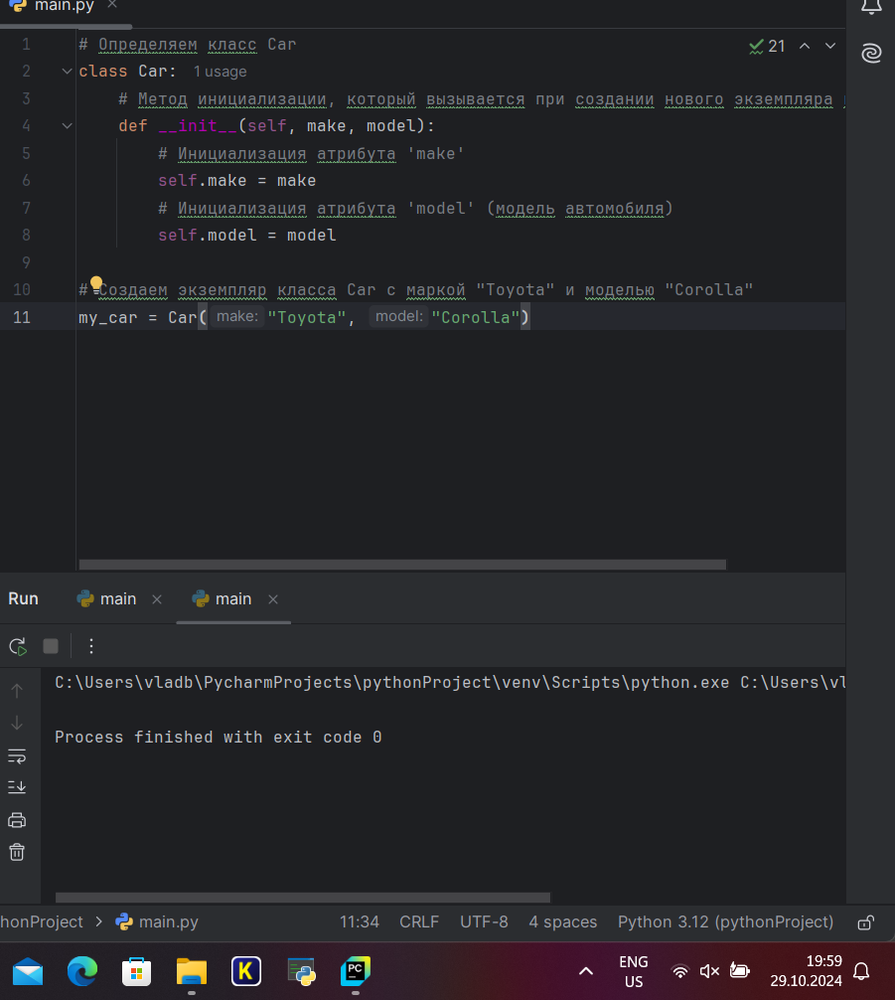

# Тема 8. Введение в ООП
Отчет по Теме #8 выполнила:
- Балахнина Евгения Николаевна
- АИС-22-1

| Задание | Лаб_раб | Сам_раб |
| ------ | ------ | ------ |
| Задание 1 | + | + |
| Задание 2 | + | + |
| Задание 3 | + | + |
| Задание 4 | + | + |
| Задание 5 | + | + |

знак "+" - задание выполнено; знак "-" - задание не выполнено;

Работу проверили:
- к.э.н., доцент Панов М.А.

## Лабораторная работа №1
Создайте класс “Car” с атрибутами производитель и модель. Создайте объект этого класса. Напишите комментарии для кода, объясняющие его работу. Результатом выполнения задания будет листинг кода с комментариями.

```python
# Определяем класс Car
class Car:
    # Метод инициализации, который вызывается при создании нового экземпляра класса
    def __init__(self, make, model):
        # Инициализация атрибута 'make'
        self.make = make
        # Инициализация атрибута 'model' (модель автомобиля)
        self.model = model

# Создаем экземпляр класса Car с маркой "Toyota" и моделью "Corolla"
my_car = Car("Toyota", "Corolla")
```
### Результат.


## Выводы
Код показывает пример создания класса и объекта, а также доступа к его атрибутам.

## Лабораторная работа №2
Дополните код из первого задания, добавив в него атрибуты и методы класса, заставьте машину “поехать”. Напишите комментарии для кода, объясняющие его работу. Результатом выполнения задания будет листинг кода с комментариями и получившийся вывод в консоль.

```python
# Определяем класс Car
class Car:
    # Метод инициализации, который вызывается при создании нового экземпляра класса
    def __init__(self, make, model):
        # Инициализация атрибута 'make'
        self.make = make
        # Инициализация атрибута 'model' (модель автомобиля)
        self.model = model
    # Метод drive, который выводит информацию о движении автомобиля
    def drive(self):
        print(f"Driving the {self.make} {self.model}")
# Создаем экземпляр класса Car с маркой "Toyota" и моделью "Corolla"
my_car = Car("Toyota", "Corolla")

# Вызываем метод drive для объекта my_car, чтобы вывести информацию о движении автомобиля
my_car.drive()
```
### Результат.


## Лабораторная работа №3
Создайте новый класс “ElectricCar” с методом “charge” и атрибутом емкость батареи. Реализуйте его наследование от класса, созданного в первом задании. Заставьте машину поехать, а потом заряжаться.
 Напишите комментарии для кода, объясняющие его работу. Результатом выполнения задания будет листинг кода с комментариями и получившийся вывод в консоль.

```python
class Car:
    def __init__(self, make, model):
        self.make = make
        self.model = model

    def drive(self):
        print(f"Driving the {self.make} {self.model}")
my_car = Car("Toyota", "Corolla")
my_car.drive()
class ElectricCar(Car):
    # Метод, расширяющий родительский класс Car
    def __init__(self, make, model, battery_capacity):
        # Вызываем метод инициализации класса Car
        super().__init__(make, model)
        self.battery_capacity = battery_capacity

    # Метод charge выводит информацию о зарядке автомобиля
    def charge(self):
        print(f"Charging the {self.make} {self.model} with {self.battery_capacity} kWh")

# Создаем экземпляр класса ElectricCar с маркой "Tesla", моделью "Model S" и емкостью батареи 75 кВтч
my_electric_car = ElectricCar("Tesla", "Model S", 75)
# Вызываем метод drive для объекта my_electric_car
my_electric_car.drive()
# Вызываем метод charge для объекта my_electric_car, чтобы вывести информацию о зарядке
my_electric_car.charge()
```
### Результат.

## Лабораторная работа №4
Реализуйте инкапсуляцию для класса, созданного в первом задании. Создайте защищенный атрибут производителя и приватный атрибут модели. Вызовите защищенный атрибут и заставьте машину поехать. Напишите комментарии для кода, объясняющие его работу. Результатом выполнения задания будет листинг кода с комментариями и получившийся вывод в консоль.

```python
class Car:
    def __init__(self, make, model):
        self._make = make # защищенный атрибут
        self.__model = model # приватный атрибут

    def drive(self):
        print(f"Driving the {self._make} {self.__model}")

my_car = Car("Toyota", "Corolla")
print(my_car._make) # доступ к защищенному атрибуту
my_car.drive()

```
### Результат.


## Выводы
В данной программе используются защищенные (_) и приватные (__) атрибуты для инкапсуляции данных, реализуются методы для управления состоянием объекта (движение/остановка) и демонстрируется доступ к защищенным атрибутам.

## Лабораторная работа №5
Реализуйте полиморфизм создав основной (общий) класс “Shape”, а также еще два класса “Rectangle” и “Circle”. Внутри последних двух классов реализуйте методы для подсчета площади фигуры. После этого создайте массив с фигурами, поместите туда круг и прямоугольник, затем при помощи цикла выведите их площади. Напишите комментарии для кода, объясняющие его работу. Результатом выполнения задания будет листинг кода с комментариями и получившийся вывод в консоль.

```python
class Shape:
    def area(self):
        pass

class Rectangle(Shape):
    def __init__(self, width, height):
        self.width = width
        self.height = height

    def area(self):
        return self.width * self.height

class Circle(Shape):
    def __init__(self, radius):
        self.radius = radius

    def area(self):
        return 3.14 * self.radius * self.radius

# Создаем экземпляр класса Rectangle с шириной 10 и высотой 5
my_rectangle = Rectangle(10, 5)

# Выводим информацию о площади прямоугольника
print(f"The area of the rectangle is: {my_rectangle.area()}")

# Создаем экземпляр класса Circle с радиусом 7
my_circle = Circle(7)

# Выводим информацию о площади круга
print(f"The area of the circle is: {my_circle.area()}")
```
### Результат.


## Выводы
В коде применяются основные принципы ООП, такие как абстракция, наследование и полиморфизм, для решения задачи расчета площадей различных фигур.

## Самостоятельная работа №1
Самостоятельно создайте класс и его объект. Они должны отличаться, от тех, что указаны в теоретическом материале (методичке) и лабораторных заданиях. Результатом выполнения задания будет листинг кода и получившийся вывод консоли.

```python
class Movie:
    def __init__(self, title, author):
        self.title = title
        self.author = author
my_movie = Movie("The Substance", "Coralie Farge")
print(f"Title: {my_movie.title}, Author: {my_movie.author}")
```
### Результат.


## Выводы
Код демонстрирует основы создания простого класса и работы с его экземпляром.

## Самостоятельная работа №2
Самостоятельно создайте атрибуты и методы для ранее созданного класса. Они должны отличаться, от тех, что указаны в теоретическом материале (методичке) и лабораторных заданиях. Результатом выполнения задания будет листинг кода и получившийся вывод консоли.

```python
class Movie:
    def __init__(self, title, director, year, genre):
        self.title = title
        self.director = director
        self.year = year
        self.genre = genre
    def get_description(self):
        return f"'{self.title}' directed by {self.director}, released in {self.year}, is a {self.genre} film."
    def is_classic(self):
        return self.year < 2000
# Создаем объект
my_movie = Movie("The Substance", "Coralie Farge", 2023, "Drama")
# Выводим описание фильма
print(my_movie.get_description())
# Проверяем, является ли фильм классическим
print(f"Is '{my_movie.title}' a classic? {'Yes' if my_movie.is_classic() else 'No'}")
```
### Результат.

## Выводы
Класс Movie был доработан с добавлением новых атрибутов. Это позволило создать более информативное и функциональное представление о фильме, а также проверить его классический статус. Реализация и вывод продемонстрировали возможность расширения классов и улучшения их функциональности для решения поставленных задач.

## Самостоятельная работа №3
Самостоятельно реализуйте наследование, продолжая работать с ранее созданным классом. Оно должно отличаться, от того, что указано в теоретическом материале (методичке) и лабораторных заданиях. Результатом выполнения задания будет листинг кода и получившийся вывод консоли.

```python
class Movie:
    def __init__(self, title, director, year, genre):
        self.title = title
        self.director = director
        self.year = year
        self.genre = genre
    def get_description(self):
        return f"'{self.title}' directed by {self.director}, released in {self.year}, is a {self.genre} film."
    def is_classic(self):
        return self.year < 2000
class Documentary(Movie):
    def __init__(self, title, director, year, genre, subject):
        super().__init__(title, director, year, genre)
        self.subject = subject
    def get_description(self):
        return super().get_description() + f" This documentary focuses on {self.subject}."
    def is_informative(self):
        return self.genre.lower() == "documentary"
# Создаем объект класса Documentary
my_doc = Documentary("The Secrets of the Sea", "Jane Doe", 2022, "Documentary", "marine life")
# Выводим описание документального фильма
print(my_doc.get_description())
# Проверяем, является ли фильм классическим
print(f"Is '{my_doc.title}' a classic? {'Yes' if my_doc.is_classic() else 'No'}")
# Проверяем, является ли фильм информативным
print(f"Is '{my_doc.title}' informative? {'Yes' if my_doc.is_informative() else 'No'}")
```
### Результат.

## Выводы
Был добавлен новый класс Documentary, который наследует от Movie, с дополнительным атрибутом subject и методом is_informative. Это позволяет расширить функциональность базового класса и добавить специфику для документальных фильмов.


## Самостоятельная работа №4
Самостоятельно реализуйте инкапсуляцию, продолжая работать с ранее созданным классом. Она должна отличаться, от того, что указана в теоретическом материале (методичке) и лабораторных заданиях. Результатом выполнения задания будет листинг кода и получившийся вывод консоли.

```python
class Movie:
    def __init__(self, title, director, year, genre):
        self.__title = title
        self.__director = director
        self.__year = year
        self.__genre = genre
    # Геттеры
    def get_title(self):
        return self.__title
    def get_director(self):
        return self.__director
    def get_year(self):
        return self.__year
    def get_genre(self):
        return self.__genre
    # Сеттеры
    def set_title(self, title):
        self.__title = title
    def set_director(self, director):
        self.__director = director
    def set_year(self, year):
        if year > 1888:  # Первые фильмы появились в конце 19 века
            self.__year = year
    def set_genre(self, genre):
        self.__genre = genre
    def get_description(self):
        return f"'{self.__title}' directed by {self.__director}, released in {self.__year}, is a {self.__genre} film."
    def is_classic(self):
        return self.__year < 2000
class Documentary(Movie):
    def __init__(self, title, director, year, genre, subject):
        super().__init__(title, director, year, genre)
        self.__subject = subject
    def get_subject(self):
        return self.__subject
    def set_subject(self, subject):
        self.__subject = subject
    def get_description(self):
        return super().get_description() + f" This documentary focuses on {self.__subject}."
    def is_informative(self):
        return self.get_genre().lower() == "documentary"
# Создаем объект класса Documentary
my_doc = Documentary("The Secrets of the Sea", "Jane Doe", 2022, "Documentary", "marine life")
# Выводим описание документального фильма
print(my_doc.get_description())
# Проверяем, является ли фильм классическим
print(f"Is '{my_doc.get_title()}' a classic? {'Yes' if my_doc.is_classic() else 'No'}")
# Проверяем, является ли фильм информативным
print(f"Is '{my_doc.get_title()}' informative? {'Yes' if my_doc.is_informative() else 'No'}")
# Меняем некоторые атрибуты и выводим обновленное описание
my_doc.set_year(1998)
my_doc.set_subject("ocean life")
print(my_doc.get_description())
```
### Результат.

## Выводы
В данной программе юыли добавлены приватные атрибуты (начинаются с двойного подчеркивания) и методы для их доступа (геттеры) и изменения (сеттеры). Также были добавлены методы для изменения и получения темы для класса Documentary. Это позволяет использовать инкапсуляцию для управления доступом к атрибутам класса и их изменению.

## Самостоятельная работа №5
Самостоятельно реализуйте полиморфизм. Он должен отличаться, от того, что указан в теоретическом материале (методичке) и лабораторных заданиях. Результатом выполнения задания будет листинг кода и получившийся вывод консоли.

```python
class Movie:
    def __init__(self, title, director, year, genre):
        self.title = title
        self.director = director
        self.year = year
        self.genre = genre
    def get_description(self):
        return f"'{self.title}' directed by {self.director}, released in {self.year}, is a {self.genre} film."
class Series:
    def __init__(self, title, creator, seasons, genre):
        self.title = title
        self.creator = creator
        self.seasons = seasons
        self.genre = genre
    def get_description(self):
        return f"'{self.title}' created by {self.creator}, has {self.seasons} seasons, and is a {self.genre} series."
# Функция для демонстрации полиморфизма
def print_description(media):
    print(media.get_description())
# Создаем объекты классов Movie и Series
my_movie = Movie("The Substance", "Coralie Farge", 2024, "Drama")
my_series = Series("The Adventure Continues", "John Smith", 3, "Adventure")
# Используем полиморфизм для вызова одного и того же метода
print_description(my_movie)
print_description(my_series)
```
### Результат.

## Выводы
В этой программе метод get_description реализован по-разному в классах Movie и Series, демонстрируя полиморфизм. Функция print_description принимает объект любого из этих классов и вызывает соответствующий метод. Это позволяет использовать один и тот же интерфейс для работы с различными типами данных

## Общие выводы по теме

Инкапсуляция скрывает детали реализации и защищает данные. Наследование позволяет новым классам использовать свойства и методы существующих классов.
Полиморфизм позволяет использовать объекты разных классов с единым интерфейсом. 
Эти принципы облегчают разработку модульного, поддерживаемого и расширяемого кода.
