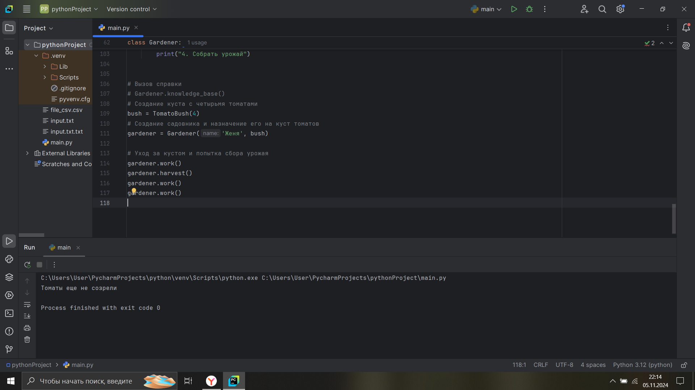

# Тема 9. Концепции и принципы ООП
Отчет по Теме #9 выполнила:
- Балахнина Евгения Николаевна
- АИС-22-1

| Задание | Лаб_раб | Сам_раб |
| ------ | ------ | ------ |
| Задание 1 | + | + |
| Задание 2 | + | + |
| Задание 3 | + | + |
| Задание 4 | + | + |
| Задание 5 | + | + |


знак "+" - задание выполнено; знак "-" - задание не выполнено;

Работу проверили:
- к.э.н., доцент Панов М.А.

## Лабораторная работа №1
Допустим, что вы решили оригинально и немного странно познакомится с человеком. Для этого у вас должен быть написан свой класс на Python, который будет проверять угадал ваше имя человек или нет. Для этого создайте класс, указав в свойствах только имя. Дальше создайте функцию init (), а в ней сделайте проверку на то угадал человек ваше имя или нет. Также можете проверить что будет, если в этой функции указав атрибут, который не указан в вашем классе, например, попробуйте вызвать фамилию.

```python
class Zhenya:
    __slots__ = ["name"]
    def __init__(self, name):
        if name == "Женя":
            self.name = f"Да, я {name}"
        else:
            self.name = f"Нет, я не {name}, а Женя"

person1 = Zhenya("Женевьева")
person2 = Zhenya("Женя")
print(person1.name)
print(person2.name)
```
### Результат.


## Лабораторная работа №2
Вам дали важное задание, написать продавцу мороженого программу, которая будет писать добавили ли топпинг в мороженое и цену после возможного изменения. Для этого вам нужно написать класс, в котором будет определяться изменили ли состав мороженого или нет. В этом классе реализуйте метод, выводящий на печать «Мороженое с {ТОППИНГ}» в случае наличия добавки, а иначе отобразится следующая фраза: «Обычное мороженое». При этом программа должна воспринимать как топпинг только атрибуты типа string.

```python
class IceCream:
    def __init__(self, ingredient=None):
        if isinstance(ingredient, str):
            self.ingredient = ingredient
        else:
            self.ingredient = None

    def composition(self):
        if self.ingredient:
            print(f'Мороженое с {self.ingredient}')
        else:
            print('Обычное мороженое')


icecream = IceCream("шоколадом")
icecream.composition()
icecream = IceCream()
icecream.composition()
icecream = IceCream(123)
icecream.composition()
```
### Результат.


## Лабораторная работа №3
Петя – начинающий программист и на занятиях ему сказали реализовать икапсу…что-то. А вы хороший друг Пети и ко всему прочему прекрасно знаете, что икапсу…что-то – это инкапсуляция, поэтому решаете помочь вашему другу с написанием класса с инкапсуляцией. Ваш класс будет не просто инкапсуляцией, а классом с сеттером, геттером и деструктором. После написания класса вам необходимо продемонстрировать что все написанные вами функции работают.

```python
class MyClass:
    def __init__(self, value):
        self._value = value

    def set_value(self, value):
        self._value = value

    def get_value(self):
        return self._value

    def del_value(self):
        del self._value

    value = property(get_value, set_value, del_value, "Свойство value")


obj = MyClass(123)
print(obj.get_value())
obj.set_value(14)
print(obj.get_value())
obj.set_value(241)
print(obj.get_value())
obj.del_value()
print(obj.get_value())  # тут ошибка, потому что вызывается метод, обращающийся к удаленному атрибуту (_value)
```
### Результат.


## Лабораторная работа №4
Вам прекрасно известно, что кошки и собаки являются млекопитающими, но компьютер этого не понимает, поэтому вам нужно написать три класса: Кошки, Собаки, Млекопитающие. И при помощи “наследования” объяснить компьютеру что кошки и собаки – это млекопитающие. Также добавьте какой-нибудь свой атрибут для кошек и собак, чтобы показать, что они чем-то отличаются друг от друга.

```python
class Mammal:
    className = "Mammal"

class Dog(Mammal):
    species = "canine"
    sounds = "wow"
    meeting = "wags his tail"

class Cat(Mammal):
    species = "feline"
    sounds = "meow"
    meeting = "rubs against your legs"

dog = Dog()
print(f"Dog is {dog.className}, but it says {dog.sounds}. During a meeting, it {dog.meeting}.")
cat = Cat()
print(f"Cat is {cat.className}, but it says {cat.sounds}. During a meeting, it {cat.meeting}.")
```
### Результат.


## Лабораторная работа №5
На разных языках здороваются по-разному, но суть остается одинаковой, люди друг с другом здороваются. Давайте вместе с вами реализуем программу с полиморфизмом, которая будет описывать всю суть первого предложения задачи. Для этого мы можем выбрать два языка, например, русский и английский и написать для них отдельные классы, в которых будет в виде атрибута слово, которым здороваются на этих языках. А также напишем функцию, которая будет выводить информацию о том, как на этих языках здороваются.
Заметьте, что для решения поставленной задачи мы использовали декоратор @staticmethod, поскольку нам не нужны обязательные параметры-ссылки вроде self.

```python
class Russian:
    @staticmethod
    def greeting():
        print("Привет")


class English:
    @staticmethod
    def greeting():
        print("Hello")


def greet(language):
    language.greeting()

ivan = Russian()
greet(ivan)
john = English()
greet(john)
```
### Результат.


## Самостоятельная работа №1
Садовник и помидоры.  
```python
class Tomato:
    # Словарь состояний, описывающий этапы созревания
    states = {0: 'Отсутствует', 1: 'Цветение', 2: 'Зеленый', 3: 'Красный'}

    def __init__(self, index):
        """
        Инициализация объекта Tomato.
        Параметры:
        index (int): Индекс томата для идентификации.
        state (int): Текущее состояние томата.
        """
        self._index = index
        self._state = 0

    def grow(self):
        """
        Метод для перехода на следующую стадию.
        Увеличивает текущее состояние на 1.
        """
        self._state = self._state + 1

    def is_ripe(self):
        """
        Проверяем, достиг ли томат стадии зрелости.
        Возвращаетbool: True, если томат созрел (стадия 3), иначе False.
        """
        return self._state == 3


class TomatoBush:
    def __init__(self, tomato_num):
        """
        Инициализация объекта TomatoBush.
        Параметры:
        tomato_num (int): Количество томатов на кусте.
        tomatoes (list): Список объектов Tomato, представляющих томаты на кусте.
        """
        self.tomatoes = [Tomato(index) for index in range(0, tomato_num)]

    def grow_all(self):
        """
        Переводит все томаты на следующую стадию.
        """
        for tomato in self.tomatoes:
            tomato.grow()

    def all_are_ripe(self):
        """
        Проверяет, все ли томаты на кусте созрели.
        Возвращает:
        bool: True, если все томаты достигли стадии зрелости, иначе False.
        """
        return all(tomato.is_ripe() for tomato in self.tomatoes)

    def give_away_all(self):
        """
        Удаляет все томаты с куста.
        """
        self.tomatoes = []


class Gardener:
    def __init__(self, name, plant):
        """
        Инициализация объекта Gardener.

        Параметры:
        name (str): Имя садовника.
        plant (TomatoBush): Куст томатов, за которым ухаживает садовник.
        """
        self.name = name
        self._plant = plant

    def work(self):
        """
        Уход за кустом: переводит все томаты куста на следующую стадию созревания.
        """
        self._plant.grow_all()

    def harvest(self):
        """
        Сбор урожая, если все томаты на кусте созрели.

        Если все томаты достигли стадии зрелости, урожай собирается,
        и все томаты удаляются с куста. Если не все томаты созрели,
        выводится соответствующее сообщение.
        """
        if self._plant.all_are_ripe():
            self._plant.give_away_all()
            print('Урожай собран')
        else:
            print('Томаты еще не созрели')

    @staticmethod
    def knowledge_base():
        """
        Вывод информации о порядке действий для ухода за кустом томатов.
        """
        print("Справка по садоводству: ")
        print("1. Посадить куст томатов")
        print("2. Назначить садовника на куст")
        print("3. Ухаживать за кустом")
        print("4. Собрать урожай")


# Вызов справки
# Gardener.knowledge_base()
# Создание куста с четырьмя томатами
bush = TomatoBush(4)
# Создание садовника и назначение его на куст томатов
gardener = Gardener('Женя', bush)

# Уход за кустом и попытка сбора урожая
gardener.work()
gardener.harvest()
gardener.work()
gardener.work()

# Сбор урожая
gardener.harvest()
```
### Тест 1. Вызов справки.

### Тест 2. Создание объектов классов TomatoBush и Gardener.

### Тест 3. Ухаживание за кустом через объект класса Gardener.

### Тест 4. Попытка сбора недозревших помидоров. Продолжение ухаживания.

### Тест 5. Сбор урожая.

### Результат.
В данной программе разработаны классы Tomato, TomatoBush и Gardener, которые представляют собой модель томата, куста томатов и садовника соответственно. 
Класс Tomato описывает томат, проходящий через четыре стадии созревания, которые определены в словаре states. 
Метод grow позволяет томату перейти на следующую стадию созревания, а метод isripe проверяет, достиг ли он зрелости. 
Инкапсуляция состояния осуществляется с помощью защищенных атрибутов index и state, которые управляют идентификацией и стадией созревания конкретного томата. 
Класс TomatoBush представляет куст с массивом томатов и использует метод growall для перевода всех томатов на кусте на следующую стадию. 
Метод allareripe проверяет, созрели ли все томаты. Метод giveawayall удаляет все томаты, что позволяет симулировать сбор урожая и обнуление состояния куста. 
Класс Gardener моделирует садовника, взаимодействующего с кустом томатов. 
Метод work переводит все томаты на следующую стадию созревания, обеспечивая регулярный уход. 
Метод harvest отвечает за сбор урожая, который возможен только при условии, что все томаты созрели; в противном случае садовник получает уведомление. 
Метод knowledge_base реализован через @staticmethod и предоставляет справочную информацию по уходу за томатами.

## Общие выводы по теме
В ходе выполнения работы были подробнее изучены ключевые принципы объектно-ориентированного программирования, такие как инкапсуляция, наследование и полиморфизм.
